<h1 style="text-align:center">Assignment 3: PathTracer</h1>
<h1 style="text-align:center">Vivien Nguyen || cs184-acd</h1>
 

  
   
  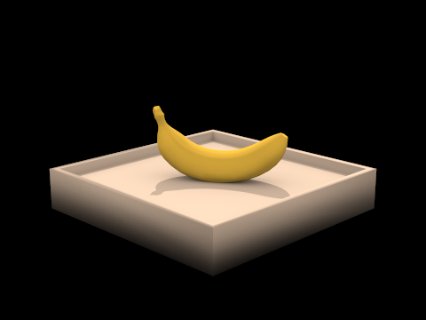

  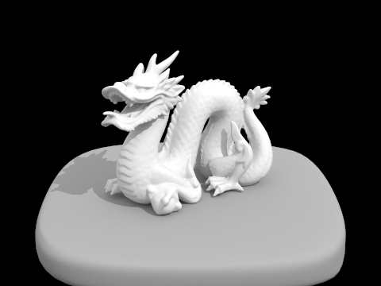
   
  

 

Overall, this project was very inspiring at the end, when I could render some incredibly detailed and realistic looking images. Along the way, I hit a lot of bugs and bumps, spending a lot of time debugging what turned out to be small coding implementations that had drastic (negative) effects, but it was all worth it in the end.

 

In this project, I implemented a ray tracing program that can render scenes via physically-based rendering - i.e. simulating the physics of light rays to achieve realistic results. This assignment began by generating rays from the camera into the scene, and calculating intersections with triangles and spheres.

 

From there, I implemented a bounding volume hierarchy to make it possible to even render some scenes that contain tens of thousands, or even hundreds of thousands of primitives! 

 

 Now, we can begin rendering surfaces by ray tracing illumination, rather than just using the surface normal of the primitives. First, we deal with direct illumination. I first wrote functions to return the BSDF (Bidirectional Scattering Distribution Function) of diffuse materials (the only one supported in my implentation of this project). Now that we have this one material though, we can importance sample area lights to support direct illumination

 

To support indirect illumination, we introduce recursive ray tracing. This adds an additional huge leap in realism by simulating the physically-based nature of light bouncing around in a scene. 

 

Finally, we'd like to be able to adaptively sample our image. Monte Carlo sampling can create a lot of noise, but some areas converge faster than others, so it's not necessary to sample sample a pixel 2048 times if it'll converge in, say, 256. For this part, I adapted the function raytrace_pixel to check for the pixel's convergence and terminate the raytracing for that pixel appropriately.

 

<h2 align="middle">Part 1: Ray Generation and Intersection</h2>
<h3>Raytrace and Generate Ray</h3>

In raytrace_pixel, we want to generate ns_aa rays and average them. If we only want one ray, then we will shoot a ray into the center of the pixel. Otherwise, we use the gridSampler to generate random samples between 0 and 1, and shoot a ray into the pixel at (x + sample, y + sample). We scale this down into a value between [0,1] to pass into generate_ray.

 

From that input point, we want to convert this point into one on a sensor plane defined in the camera space. I thought of it as a bilinear-interpolation onto a section of the plane as outlined in the specs (based on the field of view angles). I ran into some trouble at this part due to some small calculation mistakes. In any case, once we have this point, we have a ray in the camera space that can be easily converted into world space with a matrix transformation, then set various ray parameters such as origin (the camera), max and min t.

 

<h3>Intersecting Triangles</h3>

Now that we can generate rays into our scene, we want to check if they intersect any triangles. I implemented the Moller-Trumbore algorithm for this, which allows us to find the value of t (where on the ray intersection occurs), and 2 barycentric coordinates b1 and b2. From Project 1, we recall we can find the third barycentric coordinate b3 = 1 - b2 - b3. Then, again like Project 1, we know an intersection occurs inside the triangle if all three coordinates are between 0 and 1, then the ray does intersect the triangle. However, we need to make sure it's a valid intersection. If t lies within min_t and max_t of the ray, then I considered this a valid intersection and set max_t of the ray to be this t value (this keeps track of the closest intersection). Then, I populate the Intersection pointer passed in. Now we can see an empty Cornell Box! 

  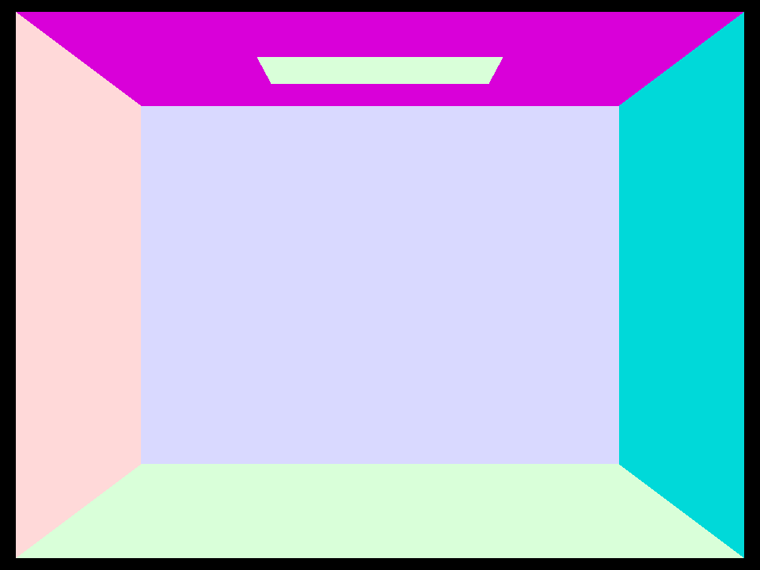
  <figcaption align="middle">An empty Cornell Box</figcaption>

 

<h3>Intersecting Spheres</h3>

To get the spheres to show up, we have to implement intersecting spheres. It's pretty similar to the code for triangles, but solving for the intersection in a more geometric way. Here, we handle both the case of the ray intersecting through the sphere as well as the ray originating inside the sphere and intersecting it going out. Essentially, if the smaller of the two intersection points is negative, we know the ray originated inside the sphere, so make the larger of the two intersection points the "real" intersection point. Then, set the Intersection pointer appropriately. 

  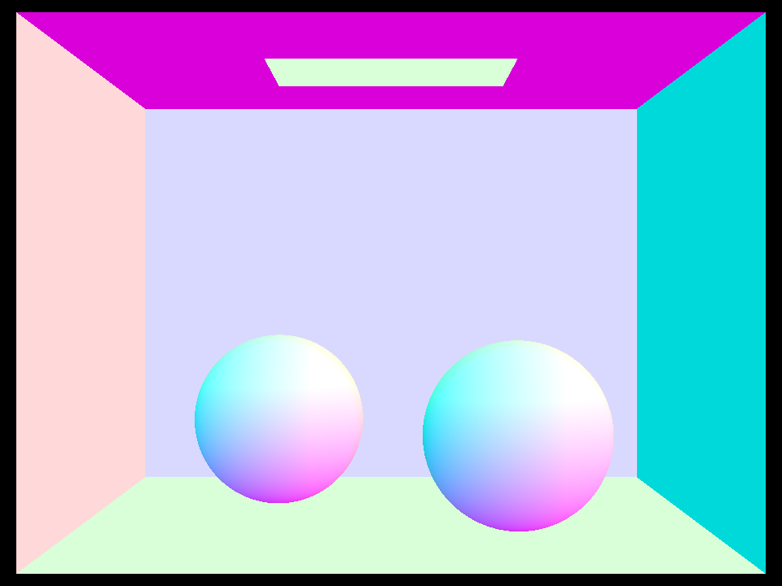
  <figcaption align="middle">...And now with spheres!</figcaption>

 
<h2 align="middle">Part 2: Bounding Volume Hierarchy</h2>
<h3>Constructing the BVH</h3>

To begin constructing my BVH, I followed the simple algorithm outlined in the specs. I began by computing the bounding box of all the primitives in the passed in list and initializing that as a BVHNode. If there were few enough elements in this list, then it was a leaf node and could be returned as such. Otherwise, I would split the primitives into two separate lists and recursively construct BVH nodes on those lists as this node's left and right children. 

 

As a simple heuristic, I used the midpoint of the largest dimension centroid box that was computed the original bounding box was being created. I split primitives based on which side of the midpoint their centroid was on. To handle the case where all the primitives ended up in one list, I arbitrarily moved half of the elements into the other list (I believe this happened infrequently enough that it was easier to just do this than introduce additional overhead). 

 

I had originally used the midpoint of the bounding box's largest dimension, but this very frequently resulted in only one element being sorted into a separate list to recurse on, which resulted in very unbalanced BVH nodes. I believe switching to the midpoint of the centroid box helped with this a lot.

 
<h3>Intersecting a Bounding Box</h3>

I used the ray aligned plane intersection equation and the ray-aligned box intersection method introduced in lecture to calculate intersections with the bounding box. For this part, I had originally implemented it checking for both intersection points being greater than 0, which I had to adapt for Part 3, where none of my shadow rays were registering as intersecting the overarching bounding volume due to originating within the box itself.

 

Other than that one hiccup, this part wasn't too bad. After a somewhat large number of relatively simple comparisons, we can get the interval that the ray intersects the bounding box in and return the correct interpretation of the interval.

 
<h3>Accelerating BVH Intersection</h3>

Implementing the recursive function itself wasn't too difficult, but I had a few hiccups due to misinterpreting the recursive call itself. Originally, I had something like return intersect(left) && intersect(right). However, we obviously don't want to require intersections on both of the node's children. Once I had realized this, I changed it to return intersect(left) || intersect(right). However, this will cause the return to short circuit - if there is an intersection in the left child, it won't bother checking the right child. This creates a problem since we are frequently (not always, but often) interested in the closest intersection.

 

This resolved itself by storing the results of intersect(left) and intersect(right) as two boolean variables, and then returning the OR of those two variables once both calls completed.

 

  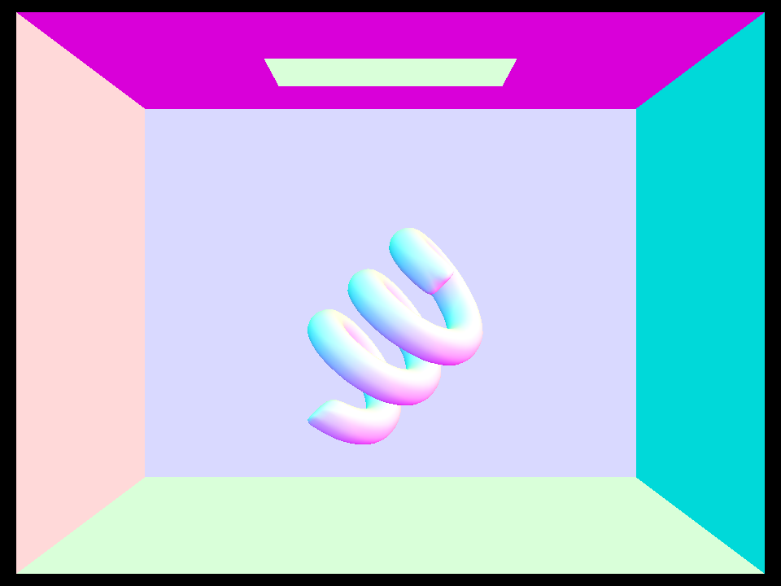
  <figcaption align="middle">A coil mesh in a Cornell Box</figcaption>
  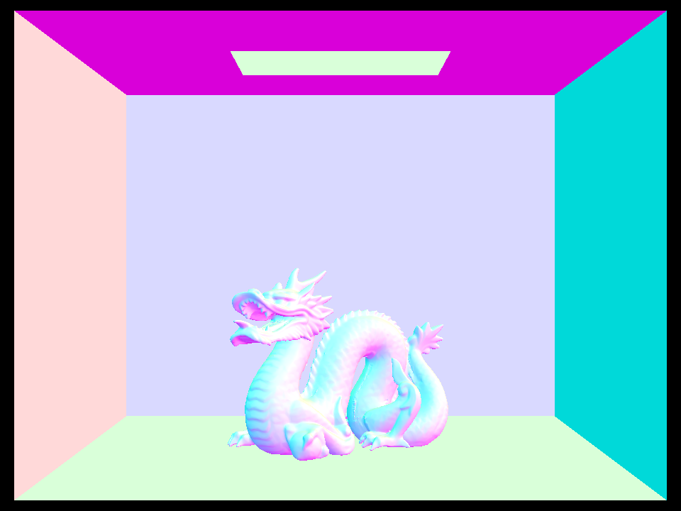
  <figcaption align="middle">A dragon mesh in a Cornell Box</figcaption>
  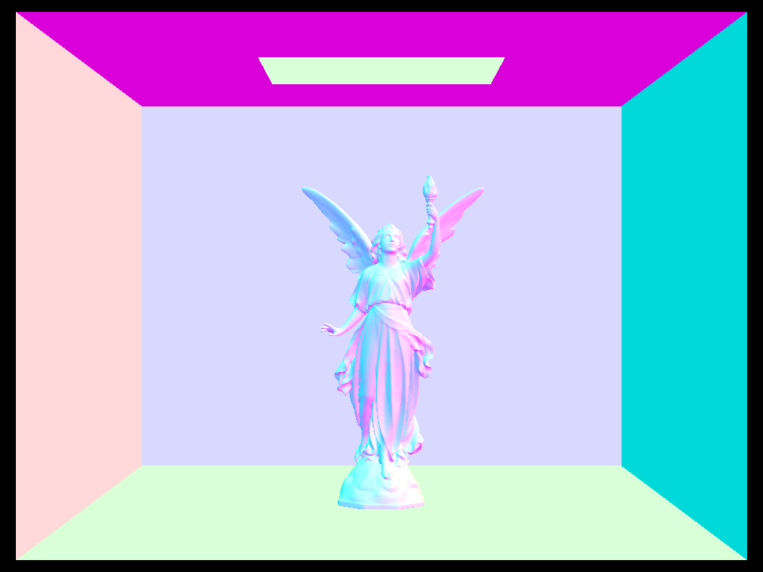
  <figcaption align="middle">A mesh of a statue of Lucy in a Cornell Box (1.2 seconds)</figcaption>

  
  <figcaption align="middle">Cow mesh</figcaption>
  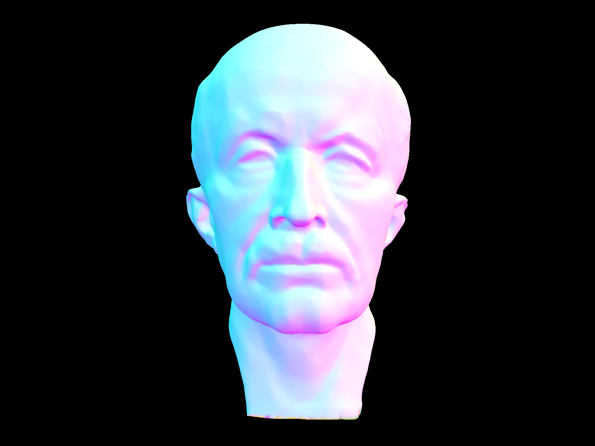
  <figcaption align="middle">Max Planck head model (2.7 seconds)</figcaption>

 

<h2 align="middle">Part 3: Direct Illumination</h2>
<h3>Getting the BSDF</h3>

Here, we essentially just return the primitive's reflectance - each material has an associated BSDF. For diffuse materials, we want to divide by pi to guarantee that the diffuse BSDF * cosine factor (Lambert's law) to integrate to at most 1 (conservation of energy!). 

 
<h3>Calculating Direct Illumination</h3>

For this part, I followed the specs as closely as possible so as not to get confused in my implementation anywhere. The end result aligned pretty nicely. We begin by computing the hit point (coordinates) of the input ray and the t value populated in the Intersection structure. We also want the ray that points in the direction of the ray towards the ray's origin (in object space). Then, looping over every light in the scene, for some number of times (number area light samples) we sample the incoming radiance and scale it by the object's reflectance. We also want to scale by the cosine factor (dot product of incoming ray and surface normal - in this case the incoming ray in object space's z value) and divide by the PDF of the sample we obtained. This value should be added to a accumlating Spectrum for this light, unless it is in shadow, in which case an empty spectrum should be added.

 

To determine whether or not a point is in shadow, I created a ray originating some epsilon in the direction of the incoming ray away from the hit point and traveling in the direction of the incoming ray. If this ray intersects some object before reaching the light source, then the hit point is in shadow. This part highlighted several earlier errors I had in BVH traversal/bounding box intersection.

 

Now we know what value (empty spectrum or the calculated one) to use for this sample, we add it to our accumulator. At the end, average by the number of samples taken for this light, and add that value to L_out.

 

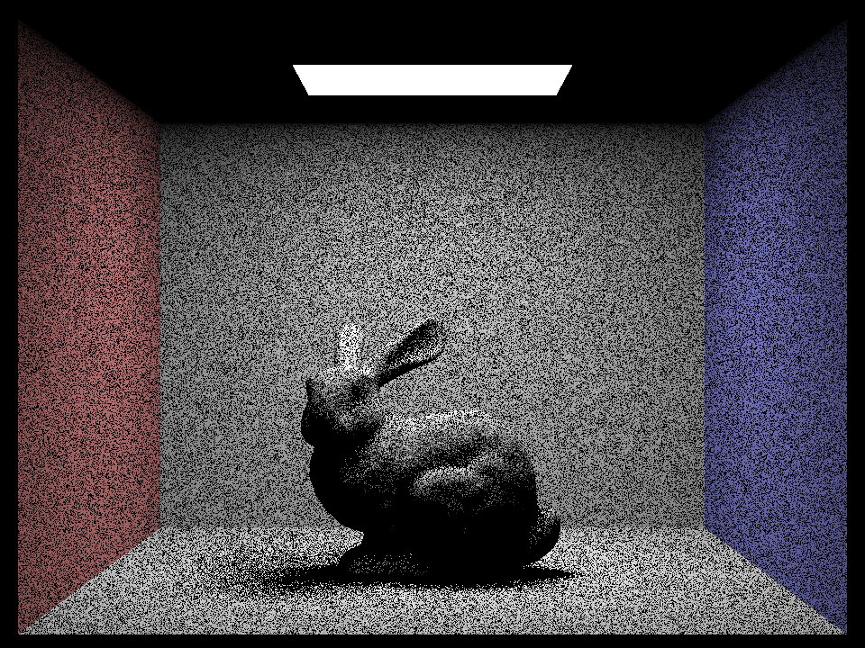
<figcaption align="middle">Bunny in a CB with 1 light ray</figcaption>
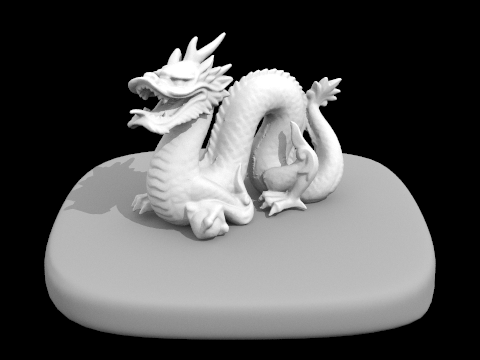
<figcaption align="middle">Dragon model with direct illumination</figcaption>

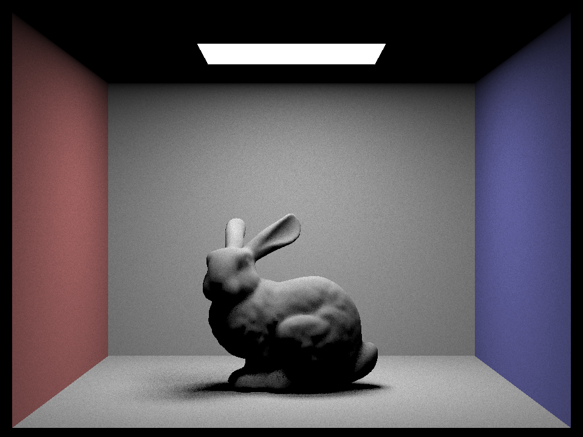
<figcaption align="middle">Bunny in a CB with 64 light rays</figcaption>

<figcaption align="middle">Banana model with direct illumination</figcaption>

 
<h3>Varying Number of Light Rays</h3>

The following images were rendered with 1 sample per pixel and varying numbers of samples per area lights. If we pay special attention to the shadows, it softens out much more smoothly at higher sampling rates. Excusing the noise as a result of low pixel sampling, the images that demonstrate sampling with 1 or 4 light rays have basically 3 areas on the floor: total shadow, soft shadow, and lit floor. In contrast, 16 and 64 light rays give us a defined contrast between total and soft shadow, but much more smoother fall off from soft shadow to lit floor, for a more natural look.

 

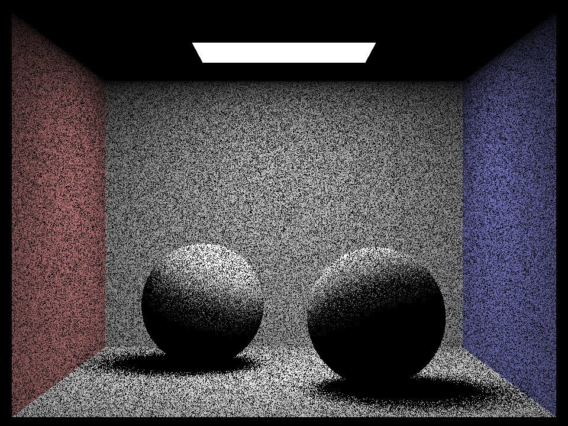
<figcaption align="middle">Spheres with 1 light ray</figcaption>

<figcaption align="middle">Spheres with 16 light rays</figcaption>

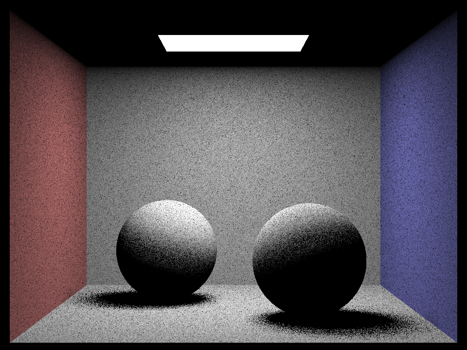
<figcaption align="middle">Spheres with 4 light rays</figcaption>

<figcaption align="middle">Spheres with 64 light rays</figcaption>

 

<h2 align="middle">Part 4: Indirect Illumination</h2>
<h3>Calculating Indirect Illumination</h3>

When an area light lights up a room, it does more than just illuminate the objects it directly hits - these light rays bounce around the room, causing some degree of illumination throughout. This recursive ray tracing is intended to imitate that physical effect. This part is relatively similar to the previous part in terms of calculating incoming radiance and outgoing irradiance, but we introduce the idea of Russian Roulette termination - we want to terminate rays that won't contribute much to the luminance of the scene anyway. Otherwise, if the ray isn't terminated, we want to create a new recursive ray heading out from the hit point.

 

We do want to decrease our ray's depth, to prevent infinite recursion - since we are running a computer program, we want to ensure that we will absolutely terminate the ray at some point. The recursive ray then follows the same path as any other ray, and has associated radiance due to its own direct light and indirect light estimations. We want to make sure we also divide this ray by both the sampling PDF and the Russian Roulette probability of not terminating, in addition to all the usual scalings like the previous part.

 

Below are some images of models lit by global illumination, as well as direct and indirect only. For indirect illumination, I wasn't sure how to hard-code this state, so for this render, I had direct illumination return an empty spectrum if ray depth == max_ray_depth. However, this resulted in the area light still rendering, though I believe the rest of the scene is correct.

 

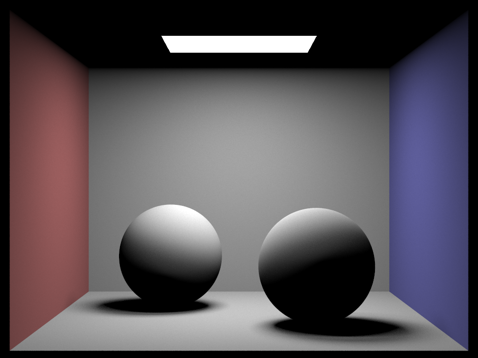
<figcaption align="middle">Spheres with direct illumination only</figcaption>

<figcaption align="middle">Spheres with global illumination</figcaption>

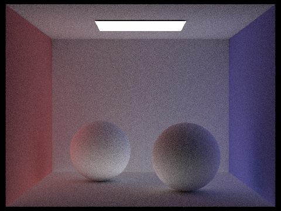
<figcaption align="middle">Spheres with indirect illumination only</figcaption>

<figcaption align="middle">Dragon with global illumination</figcaption>

 

<h3>Altering Max Ray Depth</h3>

The following images have been rendered with 1024 samples per pixel, 4 light samples per area light, and varying max ray depth. We can see increasing max ray depth somewhat brightens the image as light rays are less likely to be killed off within very few bounces. When we allow up to 100 bounces, we essentially leave it up to "Russian Roulette" to terminate. This especially noticeable in the reflectance of the walls' colors on the ceiling, floor, and model, as well as in the softness of the shadow and  However, overall we notice that even just adding a single bounce brightens the scene noticeably, and each addition to depth has decreasing effect.

 

<figcaption align="middle">Max ray depth = 0</figcaption>
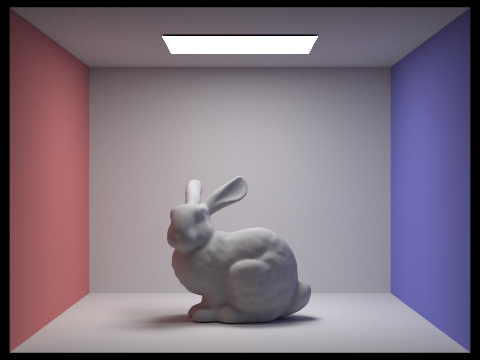
<figcaption align="middle">Max ray depth = 3</figcaption>

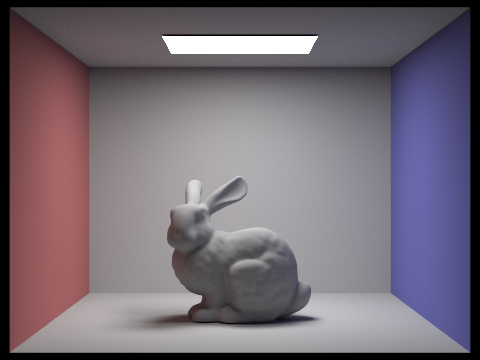
<figcaption align="middle">Max ray depth = 1</figcaption>
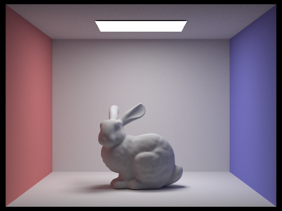
<figcaption align="middle">Max ray depth = 100</figcaption>

<figcaption align="middle">Max ray depth = 2</figcaption>

 

<h3>Varying Samples Per Pixel</h3>

These were rendered with max ray depth 100, 4 light samples per area light, and varying samples per pixel. As we can see here, it takes a bit longer than Russian Roulette ray recursion to converge - even 64 samples per pixel results in a fairly noticeable amount of noise. 

 

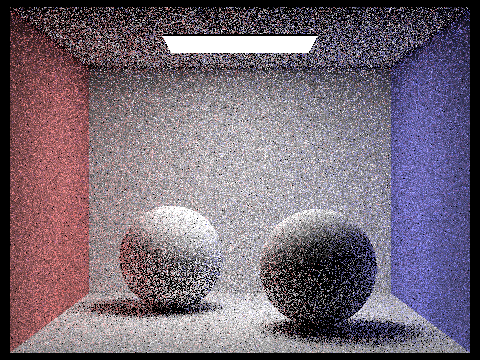
<figcaption align="middle">Samples per pixel = 1</figcaption>

<figcaption align="middle">Samples per pixel = 8</figcaption>

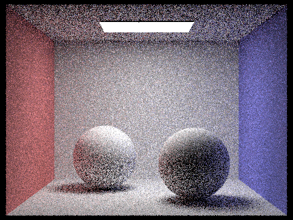
<figcaption align="middle">Samples per pixel = 2</figcaption>
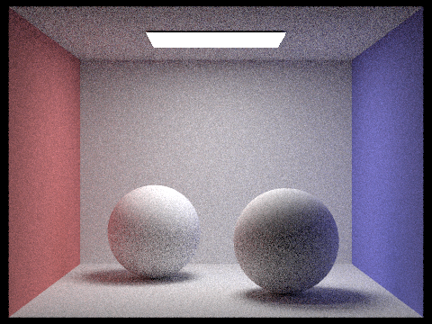
<figcaption align="middle">Samples per pixel = 16</figcaption>

<figcaption align="middle">Samples per pixel = 4</figcaption>

<figcaption align="middle">Samples per pixel = 64</figcaption>

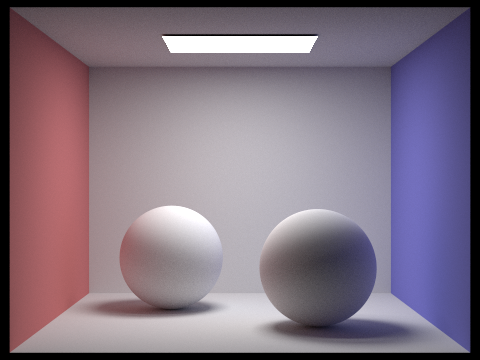
<figcaption align="middle">Samples per pixel = 1024</figcaption>

 

<h2 align="middle">Part 5: Adaptive Sampling</h2>

Implementing adaptive sampling is relatively simple at a high level. Say we input 2048 as our samples per pixel parameter. This is desirable since more samples per pixel eliminate noise, allow us to resolve more details, etc. Naturally, though, this is very costly! Especially since may areas of our scene do not require 2048 samples to "look good", we'd like to avoid taking more samples than are necessary. With adaptive sampling, we can dynamically determine if we want to continue taking samples or if the average samples we've taken for this pixel have already converged.

 

As described in the specs, we are essentially calculating a confidence interval on the average illuminance of our pixel. When we are 95% confident that the average illuminance is within some tolerance level, we can terminate early and simply return the Spectrum value of this pixel early.

 

To achieve this, I made two "holding" variables, s1 and s2, that initialize outside of the num_samples for loop. On my first go, I had initialized these variables inside the for loop, which obviously made my renders incorrect, since we want to use s1 and s2 to accumlate the illuminance and illuminance squared of each sample, respectively. Using these values, we can calculate mean and variance at some interval. We calculate these at, say, intervals of every 32 or 64 samples, so as not to check for convergence with every sample (which can be fairly expensive in and of itself). 

 

Using the mean and standard deviation (which is the square root of the variance!!!!) we can check for convergence. If at this check, the pixel's value has converged, then we set the buffer to indicate the number of samples we actually took, and return the average for this pixel (making sure to divide by the number of samples we actually took, not the number we originally intended to take!). If the pixel hasn't converged, then we continue as usual.

 

For the picture below, we can see the sampling rate roughly corresponds to the amount of detail in the scene at that point. The area light takes very few samples to converge - it has its own emittance and isn't really affected by many things. The walls and floor take some number more to resolve reflectance, but since they are also relatively plain, they don't require many samples to converge. The ceiling and especially the bunny itself require many more samples to converge.

 

<figcaption align="middle">Bunny with adaptive sampling, max samples per pixel = 2048</figcaption>

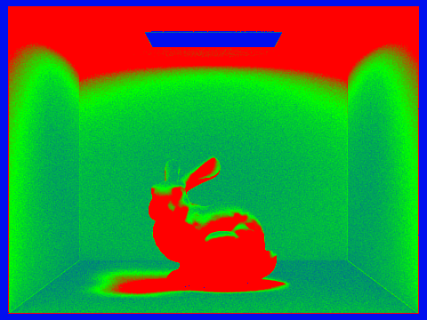
<figcaption align="middle">Sampling rate map</figcaption>

